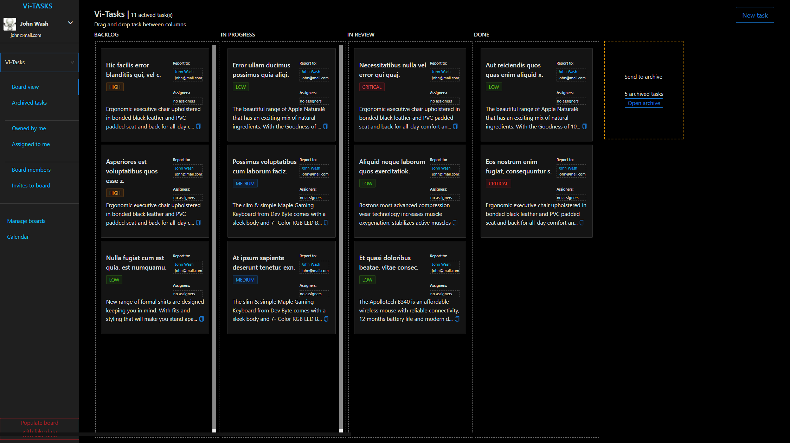
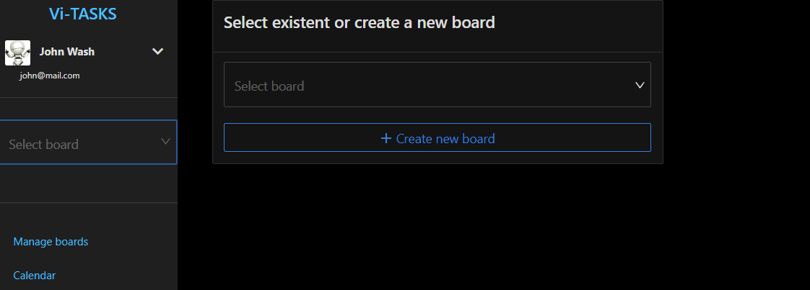
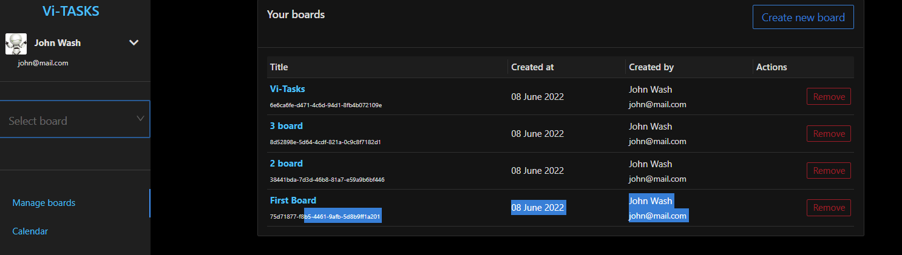
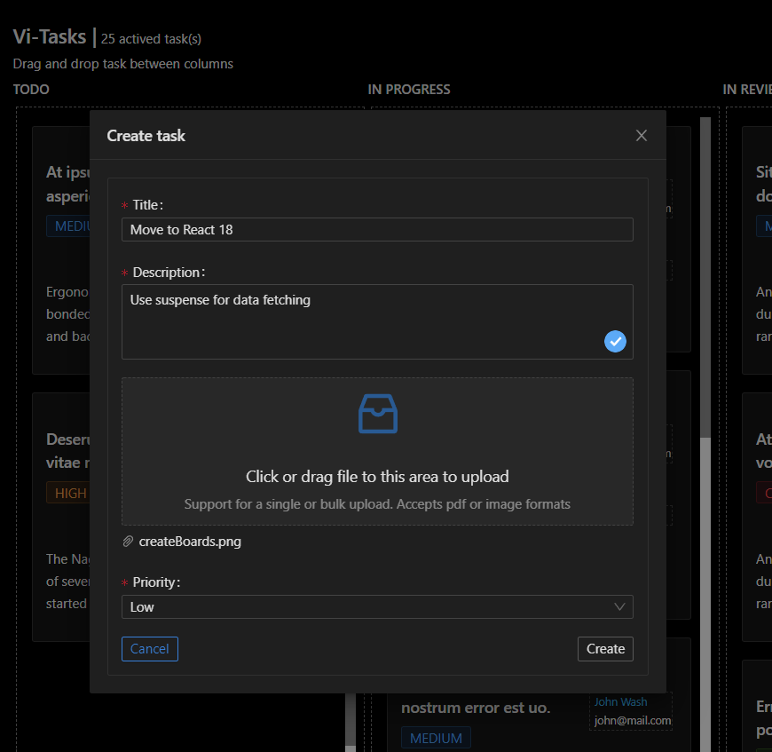
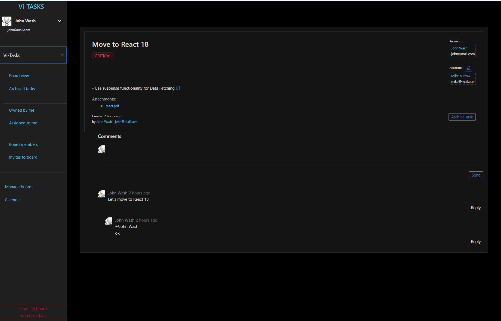
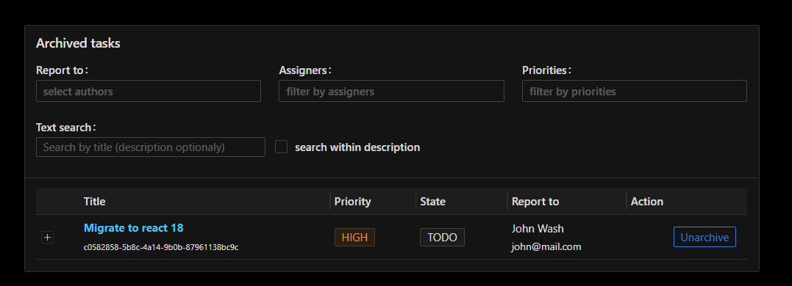
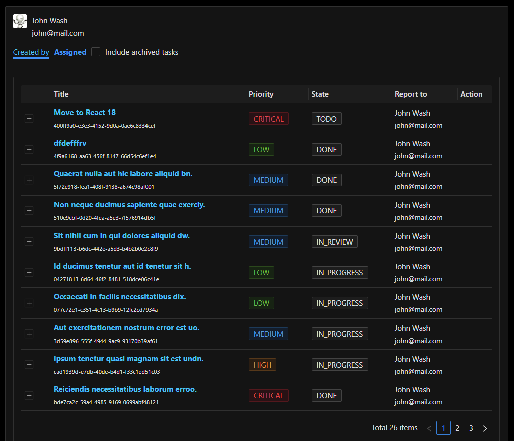
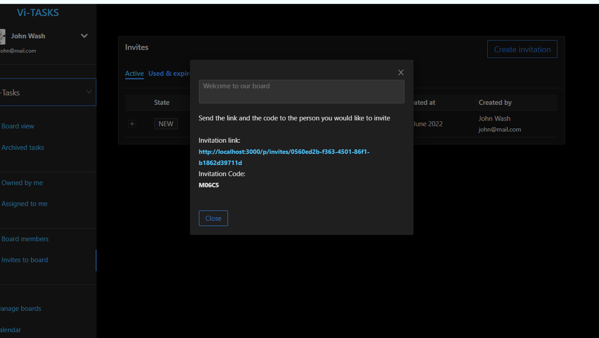

# Speed programming. Building the taskboard application

## Showcase of Postgresql + Graphql + typescript + React tech stack

 

<h3>Drag and drop the task to move between columns</h3>

<h3>Create and manage boards</h3>

  
  

 

<h3>Create tasks</h3>
<ul>
  <li>add attachment: pdf or image</li>
  <li>set priority</li>
</ul>

<h3>Manage task</h3>
<ul>
  <li>archive task</li>
  <li>add/remove assigners</li>
  <li>leave comments</li>
  <li>comment reply</li>
</ul>

<h3>Filter archived tasks</h3>

<h3>Check user tasks</h3>

<h3>Invite new users to board</h3>

<h3>Set up meetings using calendar</h3>

[How to run it](./read_HowToRunIt.md)

[Code quality check with sonarqube](./read_CodeQualityCheckWithSonarqube.md)
